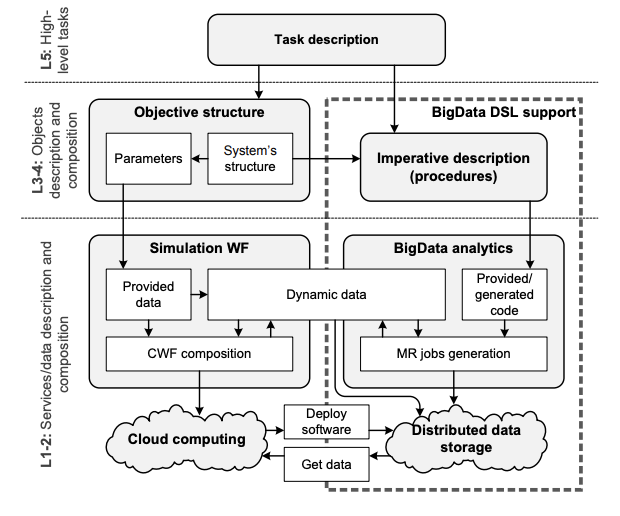

# Big Data


https://www.researchgate.net/profile/Sergey_Kovalchuk2/publication/291343973_Dynamic_Domain-Specific_Language_for_BigData_Tasks'_Description/links/56a0fcbd08ae24f62701e2d8.pdf

Patterns:



The dynamic DSL being developed within the knowledge-based approach incorporates
the following artifacts:

 - **Domain-specific semantics**. A set of domain-specific objects which are used to
describe the structure of investigated system is defined. This part of knowledge
enables interconnection with WF and simulation procedures on the levels L4-5.
 - **Data formats**. To support the integration and high-level definition of the task, the
semantically marked data of format description and atomic analysis procedures
should be described.
 - **Data aggregation patterns**. To interpret imperative description of procedures
within the high-level task with MapReduce code generation, the data aggregation
and statistical analysis procedures should be available.
 - **Cloud infrastructure knowledge**. should be provided to support a) further
processing of the results by the other parts of composite application; b) call the
local software described in the same way as regular cloud computing services.

即：

1. 领域特定的语义
2. 数据格式
3. 数据聚合模式
4. 云基础设施知识

```
require BSHFile, projects, inControlPoints, points, searchedhirlam;

script CycloneSearch runs BDDSL (
 dir = "/data/path", tag = "ERA"
)

{:
 select Cyclone where (
trajectory_path = "(65.67, 8.19), (65.97, 23.45), (60.97, 31.45)"
accuracy = "(5, 5)"
 )
 out Cyclone.Parameters() as outs
:};

step CycloneStatistialAnalysis runs scilab (
 input_folder = CycloneSearch.Result.outs["data/out"],
 script_name = "SCI_stat.sce"
);

script FloodSimulation runs BDDSL (
 dir = "/data/path", tag = "HIRLAM",
 config = CycloneStatistialAnalysis.Result.outs["output.dat"],
 points = points, projects = projects, BSHFile = BSHFile,
 searchedpattern = searchedhirlam, inControlPoints = inControlPoints
)

{:
 select Forecast where (
preasure_field = searchedpattern
 )
 simulate package cyclonegenerator with parameters (
 inConfigFile = configFile
 forecastField = Forecast.field
 )
 simulate VSO FloodSim from cyclonegenerator.Result [points, projects,
 BSHFile, inControlPoints] to FloodSimulation
 out FloodSim.Result as out
:};

step FloodStatistialAnalysis runs scilab
(
 input_folder = FloodSimulaiton.Result.outs["/out/"],
 script_name = "FLOOD_stat.sce"
);
```